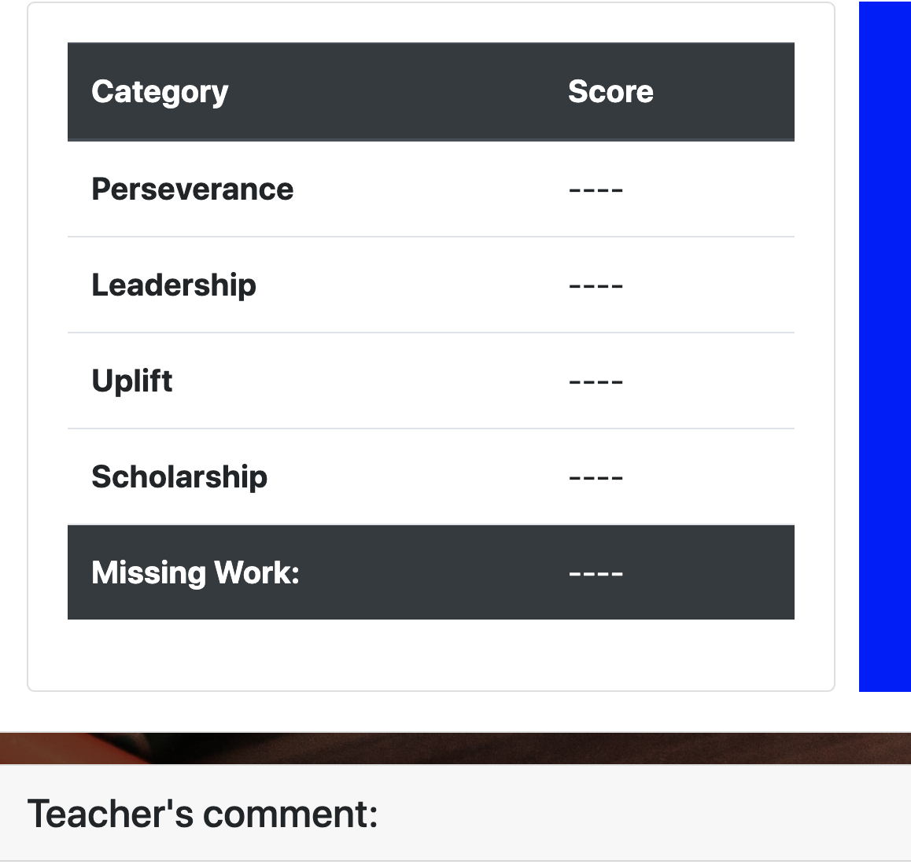
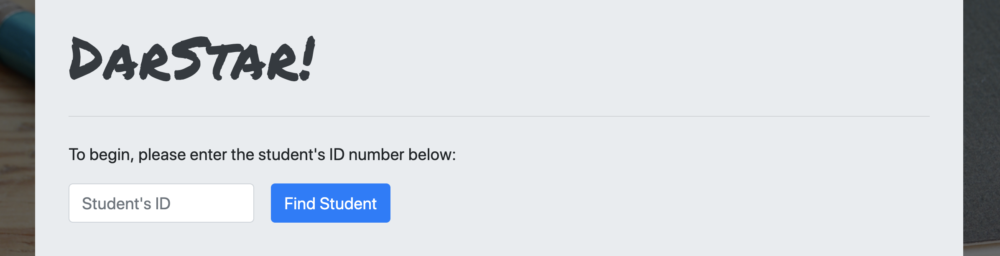
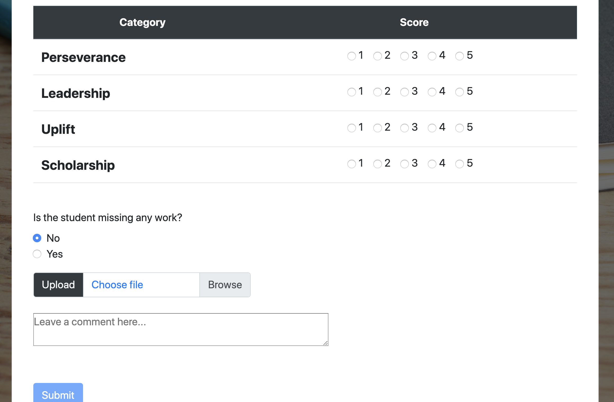

# Darstar Behavior Tracker

This application is the bridge between the parent and teacher.  The teacher will fill out a form daily which the parent after entering their student id number, will be able to review and contact the teacher.

## Stay in constant communication with the teacher or parent.

The user can visit the site and will choose if they are the parent or teacher.  It will then take them to the parent login screen or teacher login screen.

#### Sample of Home Screen

## How did my child do today?

If the user clicks the parent login they will need to enter the **Student ID** given to them to retrieve the students information.

#### Sample of Parent login screen

Once the Id is entered the results show how that student did that day according to the teacher.  The teacher will fill out the fields below that the parent can view:

* Through 4 different criteria the student will be evaluated on a number 1-5 _(1 being the lowest 5 being the highest)._
* The teacher will notify the parent if the student is missing homework with a **Yes or No**.
* The 4 criterias entered by the teacher will result in a color which will be shown to the parent **Blue**, green, yellow, orange, and **Red**.  With **Blue** being the student that was behaved and **Red** being the student was disruptive.
* Comments made by the teacher will be shown in this field
* The parent can click a button that will send a message to the teacher if the parent wants to make a comment.

#### Sample of student evaluation screen

## Evaluating the Student

If the user clicks the teacher login they will need to enter the **Student ID** they want to evaluate.

#### Sample of teacher login screen

Once the Id is entered the evaluation form is displayed for the teacher to fill in.  The fields below will be filled in by the teacher:

* 4 categories that will have a number range 1-5 _(1 being the lowest 5 being the highest)._
* If the student was missing any homework with a **Yes or No**.
* The teacher can leave a comment for the parent to see.

#### Sample of teacher evaluation form

# Resources

NPM used _(Node Package Manager)_: dotenv, express, moment, mysql2, and sequelize
API used: [Open Weather Map](https://openweathermap.org/)
Library, package or technology used: [JQuery](https://jquery.com/), [Momentjs](https://momentjs.com/), [Google Fonts](https://fonts.google.com/), and [Bootstrap](https://getbootstrap.com/)

[Heroku](https://www.heroku.com) is used to host the application

## Contributers

* [Stama Eleazar](https://github.com/seleazar10)
* [Ricardo Rodriguez](https://github.com/Runexz)
* [Darrian](https://github.com/CodingStudentDarrian)
